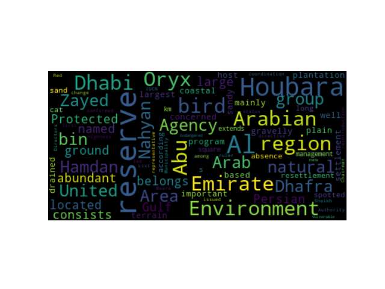
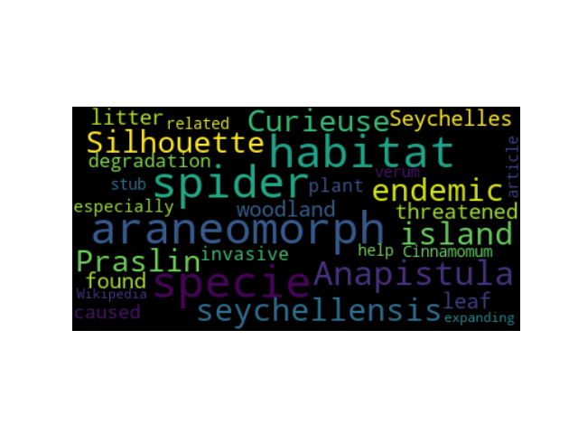
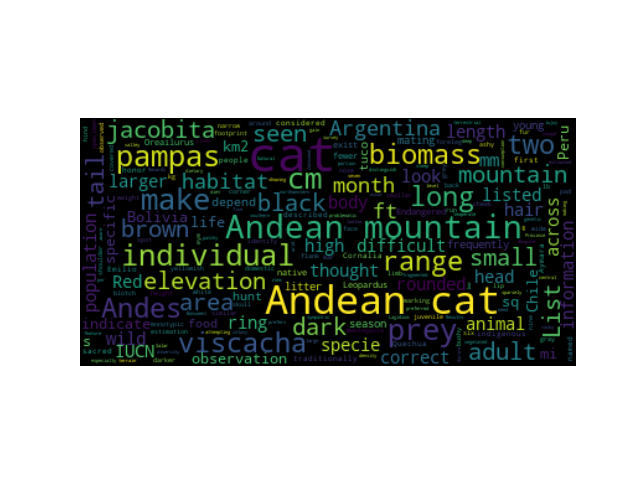
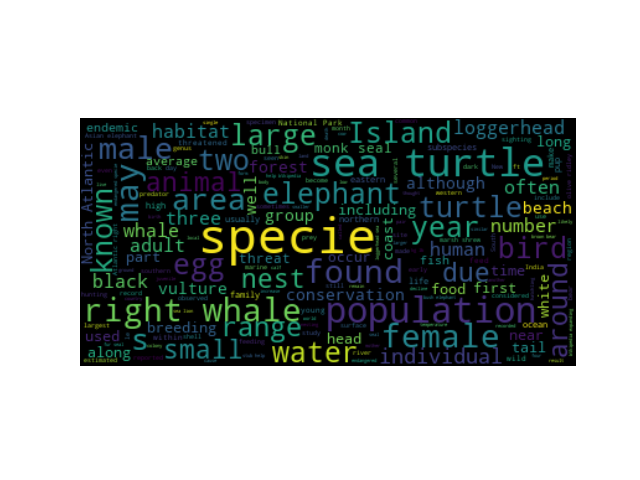

# Problem Set 4: Creating a text analysis pipeline.

In this problem set, you will be using the tools and libraries we've been learning about in class to build a pipeline for acquiring, parsing, tokenizing, normalizing, stemming, and analyzing a large amount of text.

You will submit a single `.tgz` file containing the deliverables described at the end of this README.

I recommend writing this in Jupyter at first so that you are not repeatedly hitting the Wikipedia website each time your run your program. You can save the text for each page once, then do whatever you need to do with it. Then restart your kernel, run all your code to make sure it works, then put all the code in a `.py` file.

**You must comment your code! We want to be able to give you partial credit, but if there are no comments, we can't do this. I will ask the TAs to deduct 10% of your final grade if you do not provide helpful and detailed comments.**

This problem set is due Monday, October 30, at 11:59pm EDT.

---

## Part 1: Selecting your data sources

Select *three* Wikipedia category pages from the [Wikipedia Category page](https://en.wikipedia.org/wiki/Special:Categories). You can search in the box under "Display categories starting at:" to find a category you might be interested in. Here are some examples of what a Category page looks like:

* [Endangered Animals](https://en.wikipedia.org/wiki/Category:Endangered_animals)
* [House of Tudor](https://en.wikipedia.org/wiki/Category:House_of_Tudor)
* [Aircraft Carriers of the United States Navy](https://en.wikipedia.org/wiki/Category:Aircraft_carriers_of_the_United_States_Navy)

You want to make sure to select three pages that have at least 10 links under "Pages in category X". Don't worry about subcategories.

## Part 2: Getting the text for a particular category page

Write a Python program that will take two arguments: (1) the URL to any one of your three Wikipedia pages, and (2) the number of links you want to process, which is based on how many links to "Pages in Category X" are actually on the page. Look at the [sample code for Class 7.2 in the file `basic_webscrape.py`](https://github.com/CSCI-2349-F23/sample_code/blob/main/class7.1/basic_webscrape.py) to remember how this works.

Create an empty list of strings, where each string represents the contents of one of the links under "Pages in Category X". Then, for each link under "Pages in Category X" that you find on your category page:

1. Go retrieve that page.
2. Extract all the text.
3. Replace all new lines with a single space.
4. Remove anything within square brackets or angle brackets.
5. Save all of that as a string.
6. Add that string to the list of strings. 

At the end of this process you will have a list of strings, one string for each of the links you followed. The strings will be very long since each one will contain all the text of a Wikipedia page.

**Note: The way some Category pages are set up, the first link after "Pages in Category X" is to a help page for Wikipedia editors. If you notice this in your pages, you can delete the first element in your lists with `del yourlistname[0]`.**

### Q1: How many strings are in your list (i.e., how many pages did you get)? What is the average number of characters in each string (i.e., the text of each page)?

## Part 3: Word tokenize
Create a new list. This will be a list of lists. Each sublist will be the tokenized text of one Wikipeda page. 

Tokenize each string in your list of strings (one string per Wikipedia page) using the nltk word tokenizer. (You can review how to word tokenize by looking at the code for [Class 8.2](https://github.com/CSCI-2349-F23/sample_code/tree/main/class8.2).) Append the output of the tokenizer (a list of tokens) to your list of lists. The length of the list should be the same as the length of the list of strings from Part 2, above.

### Q2: On average how many tokens are in a string? (Remember: each string corresponds to all the text on a particular Wikipedia page.)

## Part 4: Remove stop words
Create a really good stop word list by extending the nlkt English stop word list with things you know are missing: puncutation, could, would, without, and all those words we added in the [Class 8.2](https://github.com/CSCI-2349-F23/sample_code/tree/main/class8.2) and [9.1 sample code](https://github.com/CSCI-2349-F23/sample_code/tree/main/class9.1). I suggest spending a while adding stop words based on the output you get from your frequency distributions until you feel like you've gotten lots of closed-class (function) words. You are also welcome to search for stop lists on the web and just add lots of new words en masse.

Now, create a new list. This will be a list of lists again, with one sublist corresponding to the tokenized text of one Wikipedia page, but the sublists will have all their stop words removed.

### Q3: On average how many tokens are in a string after you remove stop words?

## Part 5: Lemmatize your token lists
Use the WordNet lemmatizer to lemmatize your stop word-free token lists, as demonstrated in [Class 8.2](https://github.com/CSCI-2349-F23/sample_code/tree/main/class8.2).

Create a new list of lists, with each sublist corresponding to the tokenized, stopword-free, lemmatized text of one Wikipedia page.

## Part 6: Create frequency distributions and word clouds

For each page you accessed:

* For each list of lemmatized stopword-free tokens, create a frequency distribution and print out the top 20 words.
* For each list of lemmatized stopword-free tokens, turn them into a string using `" ".join()` and then create one word cloud, as shown in the code for [Class 9.1](https://github.com/CSCI-2349-F23/sample_code/tree/main/class9.1). Save each word cloud to a .png file. You can use the `savefig()` function, e.g., `plt.savefig('wordcloud3.png')`.

Here are a few word clouds I created from pages from the [Endangered Animals page](https://en.wikipedia.org/wiki/Category:Endangered_animals).

Then concatenate all your lists into one giant list of lemmatized stopword-free tokens, and
* Create a frequency distribution and print out the the top 20 words.
* Turn the whole thing into one giant string using `" ".join()` (a few times!) and make a single word cloud. Save the word cloud to a .png file.

Here's the word cloud I created for all the links on the [Endangered Animals page](https://en.wikipedia.org/wiki/Category:Endangered_animals).

## BONUS OPTIONS
1. Investigate (sentence tokenization with nltk)[https://www.nltk.org/api/nltk.tokenize.html]. Sentence tokenize the text for each Wikipedia page before you word tokenize.

2. Invesigate (part of speech tagging with nltk)[https://www.nltk.org/api/nltk.tag.html]. For each sentence, get the part of speech for each word using one of the nltk part of speech taggers; then use the part of speech to improve the lemmatization step above.

---

## Deliverables
1. A single python script that does all of the above. Remember that it has two arguments: the URL of the Categories page you want to explore and an integer indicating the number of links to follow, which will be determined by the number of links under "Pages in Category X". Make sure the script prints out everything that is required above, and make sure it saves all the word clouds as jpeg images.
2. A bash script that will run your python script on all three Category pages you selected.
3. A short pdf containing the answers to the questions labeled with a Q above.

Tar and zip this all up into a single `.tgz` file called `ps4.tgz`. Submit that `.tgz` file to Canvas.

**You must comment your code! We want to be able to give you partial credit, but if there are no comments, we can't do this. I will ask the TAs to deduct 10% of your final grade if you do not provide helpful and detailed comments.**

